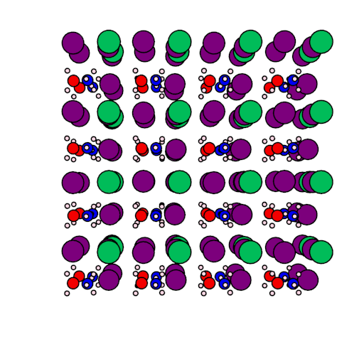
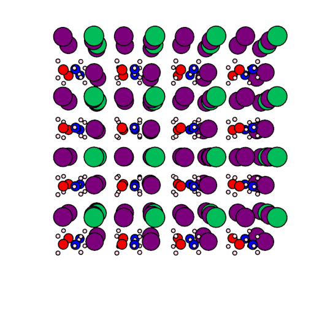
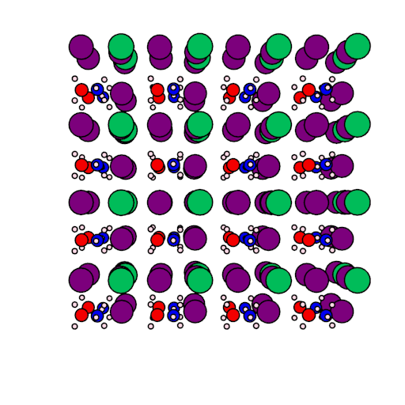

2015_MAPbI3
===========

This repository contains data discussed in the publication:

[*Lattice dynamics and vibrational spectra of the orthorhombic, tetragonal and cubic phases of methylammonium lead iodide*](http://journals.aps.org/prb/abstract/10.1103/PhysRevB.92.144308)
Federico Brivio, Jarvist M. Frost, Jonathan M. Skelton, Adam J. Jackson, Oliver J. Weber, Mark T. Weller, Alejandro R. Goni, Aurelien M. A. Leguy, Piers R. F. Barnes and Aron Walsh
*Physical Review B* **92** 144308 (**2015**)

This paper is open-access and available free of charge from APS.

# Phonon animations

## M point (imaginary)
 

## R point (imaginary)
 

## X point (real)
 

#### Generated by [ascii-phonons](https://github.com/ajjackson/ascii-phonons) using phonon eigenvectors from [Phonopy](http://phonopy.sourceforge.net).

Further Information
-------------------
Please direct any queries or requests for additional data to the authors of the paper.
